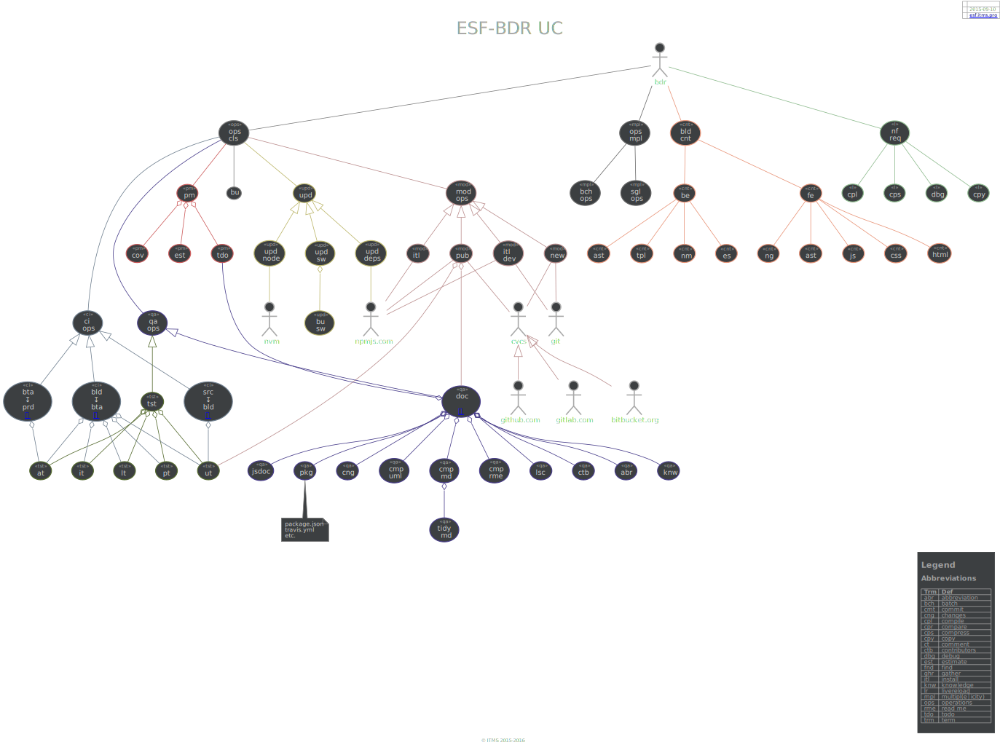
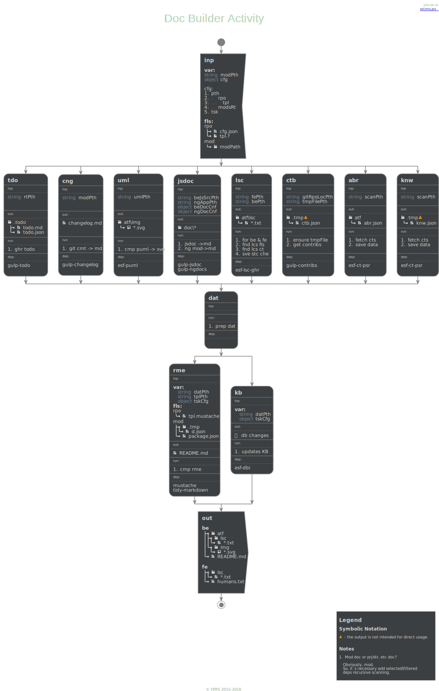
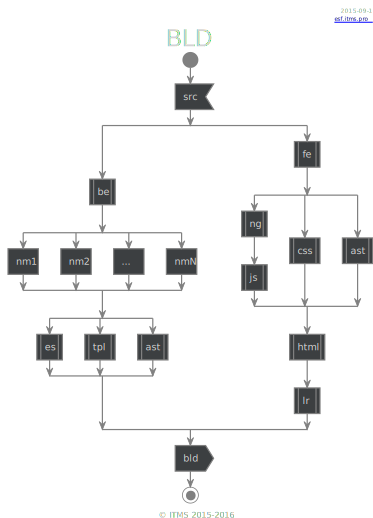
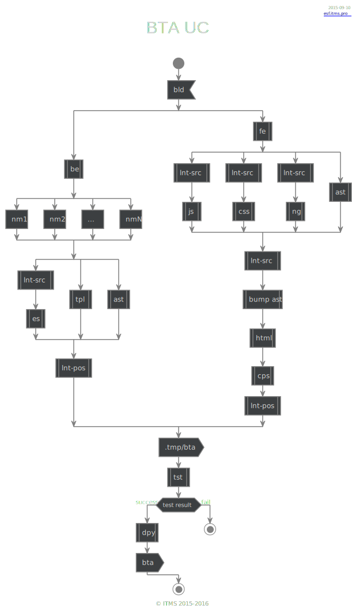

# esf-bdr

## Road map

Version | Functionality                 | API                 | Status
------- | ----------------------------- | ------------------- | ------
0.1     | Req. [pp-0.1.1](pp-0.1.1)     | `bld`, `dev`, `tst` |
0.2     | Req. [pp-0.1.2.1](pp-0.1.2.1) |                     |
0.3     | Req. [pp-0.1.2.2](pp-0.1.2.2) |                     |
0.4     | Req. [pp-0.1.3](pp-0.1.3)     |                     |
1.0     | Req. [pp-1.0](pp-1.0)         |                     |

## Requirements

### esf-bdr-1
| ReqId        | Requirement                                                                                      | Verification Methods |
| ---          | ---                                                                                              | ---                  |
| esf-bdr-1.1. | It should execute tasks. This could be done with an external tool like [gulp](http://gulpjs.com) |                      |
| esf-bdr-1.1. | It should work only with node modules / npm-packages                                             |                      |
| esf-bdr-1.1. | It should not duplicate other devOps tls fnc.: `ansible`, `npm`, `gulp`, `ci-srv`                |                      |
| esf-bdr-1.2. | It should provide [doc build pcs](#img1)                                                         |                      |
| esf-bdr-1.2. | It should provide [doc build pcs](#img1)                                                         |                      |
| esf-bdr-1.2. | It should provide [doc build pcs](#img1)                                                         |                      |
| esf-bdr-1.2. | It should provide [doc build pcs](#img1)                                                         |                      |
| esf-bdr-1.2. | It should provide [doc build pcs](#img1)                                                         |                      |
| esf-bdr-1.2. | It should provide [doc build pcs](#img1)                                                         |                      |
| esf-bdr-1.2. | It should provide [doc build pcs](#img1)                                                         |                      |
| esf-bdr-1.2. | It should provide [doc build pcs](#img1)                                                         |                      |

### esf-bdr-2
esf-bdr-2.1. It should work together with `esf-rtr` and-or [`rtracer`](https://github.com/bondden/rtracer)
 
---

## Img
| q                                                                                                                             |
| :---:                                                                                                                         |
|   |
|   |
|   |
|   |
|   |
|   |
|   |
